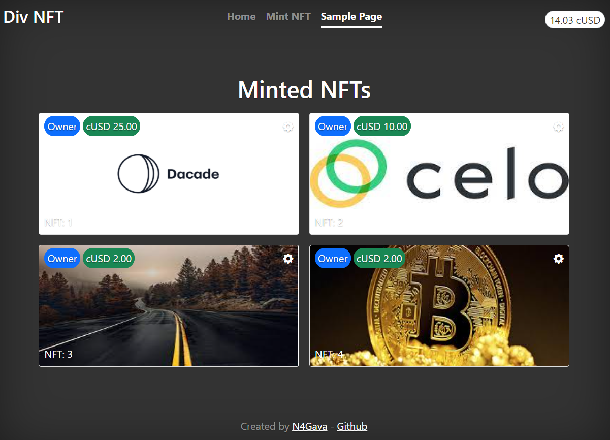

# DivNFT

DivNFT is a ERC721 token that allows you to sell part of your website.
You can generate an NFT by providing an unique identifier and putting it on sale on your site. The owner can change the image and the destination url.

The smart contract was deployed on celo alfajores network. 

Contract Address: [0xBa167453C63Fc2541A8509B3990e3CcBd6B7630D](https://alfajores-blockscout.celo-testnet.org/address/0xBa167453C63Fc2541A8509B3990e3CcBd6B7630D)

Live demo: 

## Prerequisites
1. Install the [CeloExtensionWallet](https://chrome.google.com/webstore/detail/celoextensionwallet/kkilomkmpmkbdnfelcpgckmpcaemjcdh?hl=en) extension for Chrome
2. Create your wallet
3. Connect to alfajores network 
4. Get some cUSD [here](https://celo.org/developers/faucet)

## Running
1. Install packages using `yarn install`
2. Run in development mode using `yarn start`

## Testing
1. Create a NFT on **Mint NFT** tab
2. Your NFT will be showed on **Sample Page** tab
3. You can edit your NFT by clicking on the Gear icon
4. You can buy some NFT by clicking on price

## Improvements
1. Separate the ERC721 contract from logic and storage contracts
2. Create a javascript package for helping developers to use the minted NFT in their websites
3. Develop a better UI